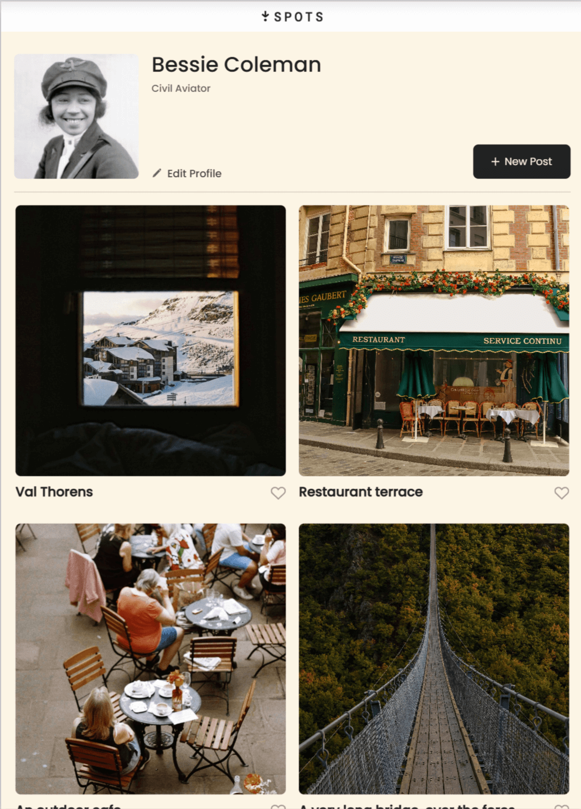
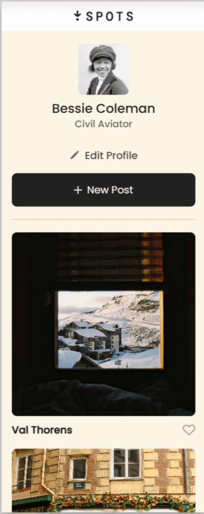

# Spots App

## Overview

Spots is an app for sharing photos on your own personal profile.

HTML and CSS have been used on this project, with media queries to create a responsive layout on all screen sizes.

### Github Pages

[Link to the project](https://bdanahy.github.io/se_project_spots/) on Github Pages

### Images

Here are some screenshots of the app, to show layout in various screen sizes.

_Note: Background color not showing properly in screenshots, but is correct in actual deployment on Github Pages_

**Desktop**  

**Tablet**  

**Mobile**  

